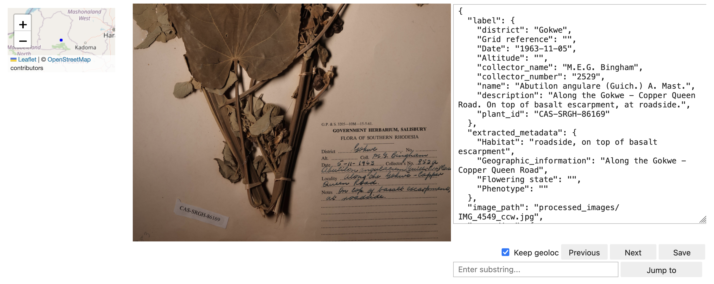

# Herbarium transcription tools
The tools in this repository were used in the transcription of labels from the national herbarium of Zimbabwe as part of a project to digitise the collection.

While adapted to the Zimbabwe collection, the scripts can be readily adjusted to be used in a different project.

The workflow contains 3 steps, requiring a folder of images as input.
1. Label transcription using OpenAI's GPT-4o model, which produces a JSON file as output.
2. Geolocation using Google Maps geocoding API.
3. Manual transcript curation with a graphical user interface via a Jupyter notebook.

Steps 1 and 2 require an OpenAI API key and a Google Maps API key, respectively.

## Initial setup

Clone or download the repository into a dedicated folder. The main requirement for step is sufficient internet bandwidth, since the images are transcribed via the OpenAI API. Steps 2 and 3 are not demanding and can be performed on any recent computer. Steps 1 and 2 were tested under Linux, step 3 under Linux and Windows, but they should work in any setup where Python and conda is available (Linux, Mac, Windows).

### Installation of Python and the required libraries
The recommended way to install the dependencies for this project is using the conda-forge distribution and their installer, Miniforge. It is available for download for the major operating systems under <https://conda-forge.org/download/>.
Download the installer and follow the instructions on the webpage.

Once conda is installed, it can be used to create a new environment and install the required dependencies for the project:

```
# Change to the directory of the downloaded/cloned repository
cd herb_transcribe
conda env create -f environment.yaml
```

The above command create an environment named `herbarium_processing`

### Obtain OpenAI API key
To use the OpenAI API, an account is required at `https://openai.com/index/openai-api/`. Once created, generate an API key according to the instructions on their website. In order for the toolkit to use it, the key needs to be exported as an environment variable.
Under Linux/Mac this can be done via

```
export OPENAI_API_KEY=<YOURKEY>
```

### Obtain Google Maps API key
The Google Maps API key can be created on the Google Maps Platform website: `https://developers.google.com/maps/third-party-platforms/wordpress/generate-api-key`

The key can be supplied to the script `geocode.py` as a command line parameter.

## Run the workflow

### Transcribe images labels into json files
The first step requires a folder with png or jpg images as input. The images can be in arbitrary orientation, the tool takes care of orienting them correctly.

First, activate the conda environment containing the dependencies:

```
conda activate herbarium_processing
```

Then, export the OpenAI API key:

```
export OPENAI_API_KEY=YOUR_KEY
```

Replace YOUR_KEY with the key you created on the OpenAI website.

Finally, change directory to the folder where your images are located, and run the transcription script (here, assuming that `~/herb_transcribe` is the location of the downloaded repository, change if required):

```
python ~/herb_transcribe/transcribe_image_folder.py --image_path .
```

The script will process each image in the folder and create a json file for each image in the subfolder. The files are named `IMAGE_ID.HERBARIUM_ID.json`, where the `IMAGE_ID` corresponds to the original image file base name, and the `HERBARIUM_ID` to the transcribed ID on the label. Sometimes, the script may terminate prematurely if an error in the OpenAI backend occurs. In this case, it can be restarted with the same command, and will skip any processed images. For faster execution, the images may be split into batches and put in separate folders, where each folder can be processed independently.

#### Json file structure
The output is a json file, where the information from each label is put into a consistent structure which can be subsequently aggregated or put into a database. The following prompt was used to create the output; this also serves as a reference of the json format produced by the tool:

```
Please transcribe the text in label of the image. The label is located in the bottom half of the image.
            and the text is in English. The text contains botanical context, but it is not required to understand the transcription.
            When transcribing, please ignore any other text that is not in the bottom half of the image. Produce the output in JSON format.
            If there is no text in the image containing the label, return a JSON object where the fields are empty, set to "". 
            The JSON should have the following structure:
            {
                "label": {
                    "district": "District or region, can be named Regio",
                    "Grid reference": "Grid reference, can be named Grid.Ref, if not available, leave empty",
                    "Date": "Date of collection, can be named Date, or Anno. Use the format YYYY-MM-DD",
                    "Altitude": "Altitude, can be named Alt., or Altitude, or Elevation. Use the format 1234 m. Can be empty if not available",
                    "collector_name": "Name of the collector, can be named Coll., or Collectors. Leave empty if not available",
                    "collector_number": "Collector number, can be named Collector's No., or Collector No., or Collector's Number. Leave empty if not available",
                    "name": "Name of the plant, located in the upper part of the label, but below the fields described above.",
                    "description": "Description of the plant, located below the name, in the lower part of the label. Separated by a line or empty space from the name. For multiple lines, use \\n to separate them.",
                    "plant_id": "Separate label, with a barcode on top of it, the text is under the barcode. Starts with SRGH. Can be rotated 90 degrees, located either above or beside the main label.",
                },
                "extracted_metadata": {
                    "Habitat": "Habitat information, extract it from the free text description, if possible, otherwise leave empty",
                    "Geographic_information": "Geographic information, extract it from the free text description, if possible, otherwise leave empty",
                    "Flowering state": "Flowering state, extract it from the free text description, if possible, otherwise leave empty",
                    "Phenotype": "Any phenotype-related information, extract it from the free text description, if possible, otherwise leave empty.",
                }
            }
            There are multiple types of labels, the text is always in the bottom half of the image, but the fields may vary.
            The structured fields are always in the top half of the label, and the free text description is in the bottom half.
            The text is in English, but it may contain some botanical terms that are not in English.
```

#### Additional parameters
calling the script with the `--help` parameter gives an overview all available options in case customisation is needed:

- **`image_path`**: Required positional argument that specifies the path to the images directory. 
- **`--processed_images_dir`**: Specifies the directory where processed images will be saved. Defaults to `"processed_images"`.
- **`--transcriptions_dir`**: Specifies the directory where transcriptions will be saved. Defaults to `"transcriptions"`.
- **`--orientated_images_dir`**: Specifies the directory where correctly orientated images will be saved. Defaults to `"orientated_images"`.
- **`--override`**: Optional flag to override existing files in the processed images and transcriptions directories.

## Geolocation
This step adds a field `geocoding` to each json file, using the fields `district` and `extracted_metadata.Geographic_information` as input for Google Maps geolocation API.

Each json file is processed individually -- for batch processing, the following `bash` snipplet can be used:

```
export GOOGLE_MAPS_KEY=<YOUR_MAPS_KEY>

# Change separator to process files with spaces
SAVEIFS=$IFS
IFS=$(echo -en "\n\b")

mkdir -p geocoded_transcriptions
for TR in transcriptions/*
do
  if [[ ! -f "geocoded_${TR}" ]]; then
    echo "Processing ${TR}"
    python3 ~/herb_transcribe/geocode.py --api_key ${GOOGLE_MAPS_KEY} "${TR}" "geocoded_${TR}"
  fi
done

# Restore separator
IFS=$SAVEIFS
```

Replace `<YOUR_MAPS_KEY>` with your Google Maps API key. The above snipplet needs to be executed in the images directory, where the previous step was performed. The path to the script (`~/herb_transcribe`) should be adapted to match your location.

## Manual curation
A curation step should be performed on each automatic transcription -- ideally -- just to confirm the results, but additional corrections may be required. To facilitate fast curation, a graphical interface is provided, implemented as a Jupyter notebook.

First, change to the directory where the downloaded/cloned scripts are located (in the example here, it is `~/herb_transcribe`). Then, start the notebook server with the following commands:

```
# Activate the conda environment, if not already done so
conda activate herbarium_processing

jupyter lab
```

This opens a web browser with the jupyter lab user interface. On the right side, open the file `curate_annotations.ipynb` with a double click. This will open the notebook.

In the first cell, adjust the `IMAGES_ROOT_PATH` variable to match the location of your images folder. The other variable `ZOOM_START` sets the initial zoom level on the map which shows the geolocation result, and can be modified to your preferences.

The checkbox `keep geoloc` can be unchecked in case the geocoding results are not satisfactory; for the images where the geolocation failed, it can be rerun after manual curation was performed. The `Jump to` function can be used to resume sessions, or to process selected images directly by entering either the image ID or the label. It performs a substring search, therefore, use the complete image ID with a . as final character, and/or the complete herbarium ID.



After curation, the corrected results are located in the subdirectory corrected_transcriptions. Images where no correction is needed can either be merged with the corrected results once all images were sighted, or you can click `Save` for each image, even when no corrections are required.

## Processing cost
For the initial set of 3849 images, the cost of using the OpenAI GPT-4o API for transcription was 43.28$, which amounts to 0.011$ per image. Since each image was processed 2 times, in order to automatically recognize the orientation, the cost could be halved if this step is not required. The use of the Google Maps API was below the free cap of 10,000 images and therefore incurred no cost. Above the free cap, geocoding an image would have cost 0.00005$. The costs given are as of June 2025.